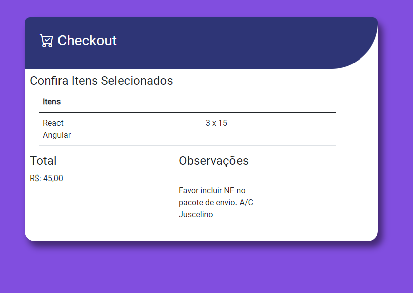

# Desafio de Desenvolvimento FrontEnd

## Desafio: implementação de um formulário.

Neste desafio, desejamos que você implemente um formulário para cadastro de pedidos de compras de adesivos. A imagem a seguir apresenta o formulário com os campos que espera-se:

## Checkout.

###### Observação: 
Sinta-se à vontade para propor modificações no formulário, especialmente, de usabilidade e funcionalidade. Se preferir você pode criar uma próxima página simulando um checkout de pagamento.

###### Objetivo:

Implementar formulário (front-end) utilizando HTML, CSS e Javascript.

1. Não limitamos o uso de bibliotecas como Vue, React, Angular.
2. O limite da implementação fica a critério do candidato;
3. Recomenda-se o uso da melhores práticas de desenvolvimento;
4. Não limitamos a arquitetura ou solução.
 

###### Critérios de avaliação:

1. Padrões de Projetos de Software;
2. Testes Automatizados;
3. Evita Bad Smells e débitos técnicos;
4. Qualidade nos detalhes.
